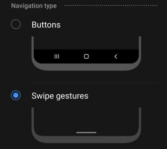

# ti.navigationmode

Titanium SDK module to detect Androids system navigation mode 



## Example

```js
import navmode  from 'ti.navigationmode';

const win = Ti.UI.createWindow();
win.open();

win.addEventListener("open", function(){
	// 0 = 3 button
	// 1 = 2 button
	// 2 = gesture

	console.log(navmode.navigationMode);
});
```
